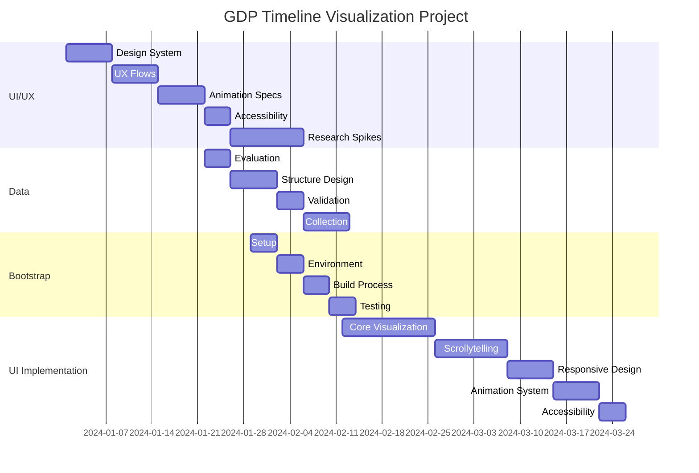

# Project Roadmap: GDP Timeline Visualization

## Implementation Order and Dependencies

### Phase 1: Foundation (Weeks 1-5)
1. **UI/UX EPIC** (5 weeks)
   - No dependencies
   - Critical for defining the visual language and interaction patterns
   - Deliverables needed by all other EPICs
   - Key milestones:
     - Design system definition
     - UX flow documentation
     - Animation specifications
     - Accessibility guidelines
     - Research spike completions

### Phase 2: Data & Infrastructure (Weeks 4-7)
2. **Data EPIC** (3 weeks)
   - Partial dependency on UI/UX EPIC
   - Can start after UI/UX research spikes are complete
   - Key milestones:
     - Data source evaluation
     - Data structure design
     - Validation framework
     - Data collection and normalization

3. **Bootstrap EPIC** (2 weeks)
   - Partial dependency on UI/UX EPIC
   - Partial dependency on Data EPIC
   - Can start after initial UI/UX guidelines and data structure designs
   - Key milestones:
     - Initial project setup
     - Environment configuration
     - Build process setup
     - Testing infrastructure

### Phase 3: Implementation (Weeks 7-12)
4. **UI Implementation EPIC** (6 weeks)
   - Full dependency on all other EPICs
   - Requires completed:
     - UI/UX specifications
     - Data structures
     - Project infrastructure
   - Key milestones:
     - Core visualization
     - Scrollytelling
     - Responsive design
     - Animation system
     - Accessibility implementation

## Timeline Overview

## Critical Path
1. UI/UX Design System & Research Spikes
2. Data Structure Design
3. Project Bootstrap
4. Core Visualization Implementation
5. Scrollytelling & Responsive Design
6. Animation & Accessibility

## Risk Factors
- UI/UX research spikes may reveal unexpected complexity
- Data normalization challenges could impact timeline
- Performance optimization might require additional iterations
- Mobile responsiveness might need extra attention

## Parallel Work Opportunities
- Data collection can begin during UI/UX phase
- Bootstrap setup can start after initial UI/UX guidelines
- Documentation can be developed throughout
- Testing infrastructure can be set up early

## Success Metrics
- All EPICs completed within timeline
- All dependencies satisfied
- No blocking issues between phases
- Smooth transition between phases
- All success criteria met for each EPIC

## Adjustment Strategy
- Weekly progress review
- Dependency validation at phase transitions
- Resource reallocation as needed
- Timeline adjustment based on progress
- Risk mitigation implementation

## Notes
- Timeline assumes full-time development
- Dates are approximate and can be adjusted
- Some tasks can be parallelized if resources allow
- Regular reviews will help identify potential blockers early 